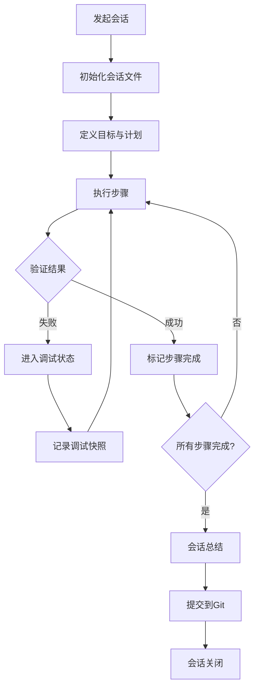

# 🤖 AI协作开发框架 - Yuzhang Neuro+AI Lab Website

**版本**: 1.0  
**创建时间**: 2025-10-26  
**参考**: GEMINI Framework (Auto-Researcher Project)  
**适用项目**: Hugo静态网站开发与内容管理

---

## 📋 目录

1. [项目概述](#1-项目概述)
2. [核心理念：会话驱动工作流](#2-核心理念会话驱动工作流)
3. [会话文件组织规范](#3-会话文件组织规范)
4. [会话生命周期管理](#4-会话生命周期管理)
5. [AI助手操作指南](#5-ai助手操作指南)
6. [项目进度跟踪](#6-项目进度跟踪)
7. [最佳实践示例](#7-最佳实践示例)

---

## 1. 项目概述

### 项目信息

- **项目名称**: Yuzhang Neuro+AI Laboratory Website
- **技术栈**: Hugo (v0.152.2 Extended) + Hugo Blox Builder + GitHub Pages
- **开发模式**: AI辅助的会话驱动开发
- **主要任务**: 内容创作、页面定制、CI/CD配置、SEO优化

### 核心目录结构

```
/mnt/data/hyf/yu_lab/
├── website/                    # Hugo网站源码
│   ├── content/               # 内容文件（Markdown）
│   ├── config/_default/       # 配置文件
│   ├── data/                  # 数据文件（BibTeX等）
│   └── static/                # 静态资源
├── docs/                      # 项目文档
│   ├── references/            # 参考文档
│   │   └── GEMINI.md         # AI开发框架参考
│   └── .ai-sessions/         # AI会话日志 ← 核心
│       ├── development/       # 功能开发会话
│       ├── content/          # 内容创作会话
│       ├── debugging/        # 问题修复会话
│       └── analysis/         # 分析与优化会话
├── .github/workflows/         # GitHub Actions配置
├── dev.sh                    # 本地开发脚本
└── build.sh                  # 构建测试脚本
```

---

## 2. 核心理念：会话驱动工作流

### 什么是会话驱动开发？

**定义**: 将每个开发任务（功能开发、内容创作、Bug修复、优化分析）视为一次独立的"会话"(Session)，全程记录操作、决策、问题与结果，形成可追溯的开发轨迹。

### 为什么需要会话驱动？

| 传统方式的问题 | 会话驱动的优势 |
|--------------|--------------|
| ❌ AI助手记忆有限，易丢失上下文 | ✅ 持久化会话日志，随时恢复上下文 |
| ❌ 开发决策过程不透明 | ✅ 完整记录思考过程和决策依据 |
| ❌ 问题重复出现，缺乏积累 | ✅ 可回溯的知识库，避免重复错误 |
| ❌ 团队协作困难，进度不透明 | ✅ 清晰的进度跟踪，便于交接 |
| ❌ 无法评估AI工作质量 | ✅ 可审计的工作记录 |

### 核心原则

```
原则 0: 会话优先 (Session First)
- 任何非平凡任务必须创建会话文件
- 会话文件是开发过程的唯一真实来源

原则 1: 实时记录 (Real-time Logging)
- 每个步骤完成后立即更新会话文件
- 记录工具调用、命令执行、结果验证

原则 2: 结构化记录 (Structured Documentation)
- 使用统一的Markdown模板
- 包含：目标、计划、执行、验证、总结

原则 3: 状态同步 (State Synchronization)
- 会话文件反映当前实际状态
- 完成步骤标记 [DONE]，进行中标记 [WIP]

原则 4: 可追溯性 (Traceability)
- 每个决策记录原因和依据
- 链接相关文档、代码、外部资源
```

---

## 3. 会话文件组织规范

### 会话文件命名约定

**格式**: `YYYY-MM-DD-HHmm-phase-X.Y-<category>-<description>.md`

**示例**:
```
2025-10-26-1400-phase-1.1-plan-mvp-content-strategy.md
2025-10-27-0900-phase-1.1-progress-homepage-development.md
2025-10-27-1430-phase-1.1-debug-hugo-build-error.md
2025-10-28-1000-phase-1.2-analysis-seo-optimization.md
2025-10-29-1800-phase-1.1-summary-week1-completion.md
```

### 命名组件说明

| 组件 | 格式 | 说明 | 示例 |
|-----|------|------|------|
| **日期时间** | `YYYY-MM-DD-HHmm` | ISO 8601格式，24小时制 | `2025-10-26-1430` |
| **阶段标识** | `phase-X.Y` | X=主要阶段，Y=子阶段 | `phase-1.1` |
| **类别标签** | `<category>` | 见下表 | `progress` |
| **描述** | `<description>` | kebab-case，1-5词 | `homepage-development` |

### 会话类别定义

| 类别 | 用途 | 频率 | 示例文件名 |
|------|------|------|-----------|
| `plan` | 实施计划 | 1-2/阶段 | `phase-1.1-plan-mvp-content-strategy.md` |
| `progress` | 日常进度日志 | 1-3/天 | `phase-1.1-progress-day1-homepage.md` |
| `content` | 内容创作记录 | 按需 | `phase-1.1-content-research-page.md` |
| `debug` | 调试会话 | 按需 | `phase-1.1-debug-deployment-fail.md` |
| `test` | 测试报告 | 按需 | `phase-1.1-test-mobile-responsive.md` |
| `analysis` | 战略分析 | 1-2/周 | `phase-1.1-analysis-progress-vs-plan.md` |
| `summary` | 阶段总结 | 1/阶段 | `phase-1.1-summary-complete.md` |
| `reference` | 快速参考 | 1-2/阶段 | `phase-1.1-reference-hugo-commands.md` |

### 目录组织结构

```
docs/.ai-sessions/
├── development/              # 功能开发类会话
│   ├── phase-1.1/
│   │   ├── 2025-10-26-1400-phase-1.1-plan-mvp-content.md
│   │   ├── 2025-10-27-0900-phase-1.1-progress-day1.md
│   │   └── 2025-10-29-1800-phase-1.1-summary-week1.md
│   └── phase-1.2/
│
├── content/                  # 内容创作类会话
│   ├── homepage/
│   │   └── 2025-10-27-0900-phase-1.1-content-hero-section.md
│   ├── research/
│   └── publications/
│
├── debugging/                # 问题修复类会话
│   ├── 2025-10-27-1430-phase-1.1-debug-toml-syntax.md
│   └── 2025-10-28-1000-phase-1.1-debug-404-error.md
│
├── analysis/                 # 分析优化类会话
│   ├── 2025-10-28-1500-phase-1.1-analysis-seo-audit.md
│   └── 2025-10-29-1000-phase-1.1-analysis-performance.md
│
└── README.md                 # 会话索引和使用指南
```

---

## 4. 会话生命周期管理

### 标准会话生命周期



### 会话模板结构

#### A. 功能开发会话模板

```markdown
# [功能名称] 开发会话

**会话ID**: YYYY-MM-DD-HHmm-phase-X.Y-progress-<desc>  
**类别**: Development / Progress  
**阶段**: Phase X.Y  
**创建时间**: YYYY-MM-DD HH:mm  
**状态**: 🟡 In Progress / ✅ Completed / ❌ Failed

---

## 📋 会话目标

简述本次会话要完成的任务：
- [ ] 目标1
- [ ] 目标2
- [ ] 目标3

**验收标准**:
- 明确的成功标准（可测试/可验证）

---

## 🎯 执行计划

### Step 1: [步骤名称]
**目标**: 简述步骤目的  
**预计时间**: X小时

**执行**:
```bash
# 命令或操作
```

**结果**: [WIP] / [DONE]

### Step 2: [步骤名称]
...

---

## 🔍 执行日志

### [时间戳] Step 1 执行

**操作**:
- 详细记录执行的操作
- 使用的工具和命令
- 修改的文件

**输出**:
```
粘贴命令输出或结果
```

**验证**:
- [x] 验证点1通过
- [x] 验证点2通过

**问题**: 无 / 描述遇到的问题

---

## 🐛 调试快照（如有问题）

### Debugging Snapshot #1

**问题描述**:
- 详细描述错误现象
- 错误信息和日志

**假设**:
- 假设的错误原因

**尝试修复**:
```bash
# 修复命令或代码修改
```

**结果**:
- 修复是否成功
- 新的观察

---

## ✅ 完成总结

**达成目标**:
- [x] 目标1 - 详细说明
- [x] 目标2 - 详细说明
- [ ] 目标3 - 未完成原因

**产出文件**:
- `website/content/xxx.md` - 主页内容
- `website/config/_default/params.toml` - 配置更新

**关键决策**:
1. 决策1及其原因
2. 决策2及其原因

**后续行动**:
- [ ] 待办事项1
- [ ] 待办事项2

**Git提交**:
```bash
git commit -m "feat: xxx"
commit: abc1234
```

---

**会话关闭时间**: YYYY-MM-DD HH:mm  
**总耗时**: X小时  
**下一会话**: `YYYY-MM-DD-HHmm-phase-X.Y-<category>-<desc>.md`
```

#### B. 内容创作会话模板

```markdown
# [页面/内容名称] 内容创作会话

**会话ID**: YYYY-MM-DD-HHmm-phase-X.Y-content-<desc>  
**类别**: Content Creation  
**目标文件**: `website/content/xxx/_index.md`  
**创建时间**: YYYY-MM-DD HH:mm

---

## 📝 内容目标

**页面**: 主页 / 研究方向 / 出版物 / ...  
**受众**: 学术界访客 / 潜在合作者 / 学生申请者  
**核心信息**:
- 关键信息点1
- 关键信息点2

---

## 📋 内容大纲

1. **Section 1: [标题]**
   - 要点1
   - 要点2
   
2. **Section 2: [标题]**
   - 要点1
   - 要点2

---

## ✍️ 内容创作

### Section 1: [标题]

**初稿**:
```markdown
[初稿内容]
```

**审阅反馈**:
- 反馈点1
- 反馈点2

**最终版本**:
```markdown
[最终内容]
```

---

## ✅ 质量检查

- [ ] 拼写检查（中英文）
- [ ] 语法检查
- [ ] 事实准确性验证
- [ ] 链接有效性测试
- [ ] SEO元数据完整
- [ ] 本地预览效果良好

---

## 🚀 发布

**本地测试**:
```bash
./dev.sh
# 浏览器访问验证
```

**提交**:
```bash
git add website/content/xxx/_index.md
git commit -m "content: add xxx page"
git push origin main
```

**线上验证**: https://autobrainlab.github.io/yuzhang-lab-website/xxx/

---

**完成时间**: YYYY-MM-DD HH:mm  
**字数统计**: 中文XXX字，英文XXX词
```

#### C. 调试会话模板

```markdown
# [问题描述] 调试会话

**会话ID**: YYYY-MM-DD-HHmm-phase-X.Y-debug-<desc>  
**类别**: Debugging  
**优先级**: 🔴 Critical / 🟠 High / 🟡 Medium / 🟢 Low  
**创建时间**: YYYY-MM-DD HH:mm

---

## 🐛 问题描述

**现象**:
- 详细描述问题表现
- 触发条件

**错误信息**:
```
粘贴完整错误日志
```

**影响范围**:
- 影响的功能/页面
- 是否阻塞其他工作

---

## 🔍 初始状态快照

**环境信息**:
- Hugo版本: v0.152.2
- 操作系统: Linux
- Git分支: main
- 最后成功的commit: abc1234

**相关文件**:
- `website/config/_default/params.toml`
- `website/content/_index.md`

**复现步骤**:
1. 步骤1
2. 步骤2
3. 观察到错误

---

## 💡 调试过程

### Debugging Snapshot #1

**时间**: YYYY-MM-DD HH:mm  
**假设**: TOML语法错误

**验证**:
```bash
hugo --verbose --debug
```

**观察**:
- 发现inline table语法不兼容

**修复尝试**:
```bash
# 修改 params.toml
# 从 appearance = { theme = "minimal" }
# 改为 [appearance]
#      theme = "minimal"
```

**结果**: ✅ 成功 / ❌ 失败

---

### Debugging Snapshot #2 (如需要)

...

---

## ✅ 解决方案

**根本原因**:
- 详细说明问题根源

**修复方法**:
- 具体的修复步骤

**验证测试**:
```bash
./build.sh
# 输出: Total in 390ms, 无错误
```

**预防措施**:
- 如何避免未来再次发生
- 是否需要更新文档/流程

---

## 📝 总结

**修复时间**: X小时  
**涉及文件**: 列出修改的文件  
**Git提交**:
```bash
git commit -m "fix: resolve xxx issue"
commit: def5678
```

**相关文档**:
- [链接到相关文档]

---

**会话关闭时间**: YYYY-MM-DD HH:mm
```

---

## 5. AI助手操作指南

### AI助手的职责

作为AI开发助手，您需要：

1. **会话管理者**
   - 为每个任务创建合适的会话文件
   - 实时更新会话状态
   - 确保会话文件的完整性和准确性

2. **执行者**
   - 按照会话计划执行开发任务
   - 记录每个步骤的操作和结果
   - 遇到问题时触发调试流程

3. **质量把关者**
   - 验证每个步骤的输出
   - 确保代码/内容质量
   - 运行必要的测试

4. **沟通者**
   - 清晰记录决策过程
   - 提供进度更新
   - 标注需要人工介入的点

### AI助手工作流程

```
┌─────────────────────────────────────────┐
│ 1. 接收任务请求                          │
└─────────────┬───────────────────────────┘
              ↓
┌─────────────────────────────────────────┐
│ 2. 分析任务类型和复杂度                   │
│    - 简单任务: 直接执行                   │
│    - 复杂任务: 创建会话文件               │
└─────────────┬───────────────────────────┘
              ↓
┌─────────────────────────────────────────┐
│ 3. 创建会话文件（如需要）                 │
│    - 选择合适的模板                       │
│    - 定义目标和计划                       │
│    - 获得用户确认                         │
└─────────────┬───────────────────────────┘
              ↓
┌─────────────────────────────────────────┐
│ 4. 执行步骤                              │
│    - 一次执行一个步骤                     │
│    - 使用工具完成操作                     │
│    - 记录到会话文件                       │
└─────────────┬───────────────────────────┘
              ↓
┌─────────────────────────────────────────┐
│ 5. 验证结果                              │
│    - 检查输出是否符合预期                 │
│    - 运行测试（如适用）                   │
└─────────────┬───────────────────────────┘
              ↓
        ┌─────┴─────┐
        │ 验证通过？  │
        └─────┬─────┘
              ↓
        是 ↙     ↘ 否
          ↓         ↓
  ┌───────────┐  ┌──────────────┐
  │ 标记完成   │  │ 进入调试状态  │
  │ [DONE]    │  │ 记录调试快照  │
  └─────┬─────┘  └──────┬───────┘
        ↓                ↓
        ↓        ┌──────────────┐
        ↓        │ 尝试修复      │
        ↓        └──────┬───────┘
        ↓                ↓
        ↓        ┌──────────────┐
        ↓        │ 重新验证      │
        ↓        └──────┬───────┘
        ↓                ↓
        └────────┬───────┘
                 ↓
┌─────────────────────────────────────────┐
│ 6. 更新会话文件                          │
│    - 添加执行日志                         │
│    - 更新进度状态                         │
│    - 提交到Git                           │
└─────────────┬───────────────────────────┘
              ↓
┌─────────────────────────────────────────┐
│ 7. 检查是否完成所有步骤                   │
└─────────────┬───────────────────────────┘
              ↓
        ┌─────┴─────┐
        │ 全部完成？  │
        └─────┬─────┘
              ↓
        是 ↙     ↘ 否
          ↓         ↓
  ┌───────────┐  ┌──────────────┐
  │ 会话总结   │  │ 继续下一步骤  │
  └─────┬─────┘  └──────────────┘
        ↓
┌─────────────────────────────────────────┐
│ 8. 关闭会话                              │
│    - 总结成果                             │
│    - 提出后续建议                         │
│    - 等待新任务                           │
└─────────────────────────────────────────┘
```

### AI助手命令速查

#### 会话创建

```bash
# 创建开发进度会话
cat > docs/.ai-sessions/development/phase-1.1/2025-10-27-0900-phase-1.1-progress-day1.md << 'EOF'
[使用progress模板]
EOF

# 创建内容创作会话
cat > docs/.ai-sessions/content/homepage/2025-10-27-1000-phase-1.1-content-hero.md << 'EOF'
[使用content模板]
EOF

# 创建调试会话
cat > docs/.ai-sessions/debugging/2025-10-27-1430-phase-1.1-debug-build-error.md << 'EOF'
[使用debug模板]
EOF
```

#### 会话更新

```bash
# 标记步骤完成
# 在会话文件中将 [ ] 改为 [x]
# 将 [WIP] 改为 [DONE]

# 添加执行日志
# 在"执行日志"部分追加新内容
# 包括时间戳、操作、结果

# 记录调试快照
# 在"调试快照"部分添加新的快照
# 包括问题、假设、修复、结果
```

#### 会话提交

```bash
# 提交会话文件到Git
cd /mnt/data/hyf/yu_lab
git add docs/.ai-sessions/
git commit -m "session: update progress for homepage development"
git push origin main
```

### AI助手决策树

```
任务复杂度判断：
├─ 简单（< 15分钟）
│  ├─ 单个文件的小修改
│  ├─ 简单的配置调整
│  └─ 操作：直接执行，简要记录在聊天中
│
├─ 中等（15分钟 - 2小时）
│  ├─ 多文件修改
│  ├─ 内容创作
│  ├─ 功能开发
│  └─ 操作：创建progress或content会话
│
└─ 复杂（> 2小时）
   ├─ 大型功能开发
   ├─ 架构变更
   ├─ 复杂问题调试
   └─ 操作：创建详细的plan会话，分解为多个子会话
```

---

## 6. 项目进度跟踪

### 阶段定义

本项目采用阶段化开发，每个阶段对应一个主要里程碑：

```
Phase 1: MVP内容开发（2周）
├─ Phase 1.1: Week 1 核心内容（P0）
│  ├─ 主页内容增强
│  ├─ 研究方向页面
│  ├─ 完整出版物导入
│  └─ 团队成员页面
│
├─ Phase 1.2: Week 2 增强功能（P1）
│  ├─ 招聘页面
│  ├─ 资源页面
│  └─ 视觉优化与测试
│
Phase 2: 功能增强（2周）
├─ Phase 2.1: 交互功能
├─ Phase 2.2: SEO优化
│
Phase 3: 持续优化（ongoing）
├─ Phase 3.1: 内容更新
├─ Phase 3.2: 性能优化
└─ Phase 3.3: 功能迭代
```

### 进度追踪文件

创建专门的进度追踪文件：`docs/.ai-sessions/PROGRESS_TRACKER.md`

```markdown
# 项目进度追踪总表

**更新时间**: 2025-10-27 09:00  
**当前阶段**: Phase 1.1  
**整体进度**: 15%

---

## Phase 1.1: Week 1 核心内容

**目标**: 完成MVP必需的核心页面内容  
**截止日期**: 2025-11-02  
**进度**: 20% (2/10 任务完成)

### 任务列表

| 任务ID | 任务名称 | 优先级 | 状态 | 负责 | 会话文件 | 完成时间 |
|-------|---------|-------|------|------|---------|---------|
| 1.1.1 | 主页Hero Section | P0 | ✅ Done | AI | [链接] | 2025-10-27 |
| 1.1.2 | 主页研究亮点 | P0 | 🟡 WIP | AI | [链接] | - |
| 1.1.3 | 主页最新动态 | P0 | ⬜ Todo | - | - | - |
| 1.1.4 | 研究方向页面 | P0 | ⬜ Todo | - | - | - |
| ... | ... | ... | ... | ... | ... | ... |

### 会话历史

- `2025-10-26-1400-phase-1.1-plan-mvp-content.md` - MVP内容规划
- `2025-10-27-0900-phase-1.1-progress-homepage-hero.md` - 主页Hero开发
- `2025-10-27-1430-phase-1.1-content-research-highlights.md` - 研究亮点内容

### 关键决策

1. **2025-10-26**: 决定采用Hugo Blox的blocks shortcode而非自定义HTML
   - 原因：更好的主题兼容性，易于维护
   - 影响：需要学习shortcode语法

### 问题与风险

- 🟠 **风险**: BibTeX导入可能遇到格式问题
  - 缓解措施：预先准备格式转换脚本
  
### 下一步行动

- [ ] 完成主页研究亮点部分
- [ ] 开始研究方向页面内容创作
- [ ] 准备PI头像照片
```

### 每日站会记录

对于密集开发期，可以创建每日站会记录：

```markdown
# 每日站会 - 2025-10-27

**参与**: 用户 + AI助手  
**时间**: 09:00

---

## 昨日完成

- ✅ 主页Hero Section开发完成
- ✅ 本地开发环境配置文档创建
- ✅ 解决TOML语法错误

## 今日计划

- 🎯 完成主页研究亮点部分（4小时）
- 🎯 开始研究方向页面大纲（2小时）
- 🎯 准备BibTeX导入脚本（2小时）

## 阻塞问题

- 等待用户提供PI头像照片
- 研究方向具体内容需要用户审阅

## 需要的支持

- 请用户确认研究方向的分类方式
```

---

## 7. 最佳实践示例

### 示例1: 主页内容开发会话

**文件**: `docs/.ai-sessions/development/phase-1.1/2025-10-27-0900-phase-1.1-progress-homepage.md`

```markdown
# 主页内容开发会话

**会话ID**: 2025-10-27-0900-phase-1.1-progress-homepage  
**类别**: Development / Progress  
**阶段**: Phase 1.1  
**创建时间**: 2025-10-27 09:00  
**状态**: 🟡 In Progress

---

## 📋 会话目标

完成主页核心内容开发：
- [x] Hero Section（英雄区）
- [ ] Research Highlights（研究亮点）
- [ ] Latest News（最新动态）
- [ ] Stats Section（数据展示）

**验收标准**:
- 本地预览效果符合设计要求
- 内容准确无误
- 移动端显示正常
- 通过用户审阅

---

## 🎯 执行计划

### Step 1: Hero Section开发
**目标**: 创建吸引人的首屏内容  
**预计时间**: 1小时

**执行**:
```bash
vim /mnt/data/hyf/yu_lab/website/content/_index.md
```

**结果**: [DONE]

### Step 2: Research Highlights卡片
**目标**: 展示3-4个核心研究方向  
**预计时间**: 2小时

**执行**:
- 设计卡片布局
- 撰写每个方向的简介
- 添加图标

**结果**: [WIP]

---

## 🔍 执行日志

### [09:15] Step 1: Hero Section开发

**操作**:
1. 启动本地开发服务器：`./dev.sh`
2. 编辑主页文件：`website/content/_index.md`
3. 添加Hero Section内容：
   - 实验室愿景一句话描述
   - 核心使命3句话展开
   - 3个CTA按钮（研究方向、最新论文、加入我们）

**代码**:
```markdown
---
title: "Yuzhang Neuro+AI Lab"
type: landing
---

# 探索智能的神经基础

我们致力于通过计算神经科学和人工智能的交叉研究，
理解大脑智能的原理，推动下一代AI技术发展。

[研究方向](/research/) | [最新论文](/publications/) | [加入我们](/join-us/)
```

**本地预览**:
- 访问 http://localhost:1313/yuzhang-lab-website/
- 效果符合预期

**验证**:
- [x] 文字内容准确
- [x] 链接有效
- [x] 移动端显示正常
- [x] 视觉效果良好

**问题**: 无

---

### [10:30] Step 2: Research Highlights开发（进行中）

**操作**:
1. 设计卡片布局（3列网格）
2. 从项目文档提取研究方向

**内容大纲**:
- 研究方向1: 脑网络连接组学
  - 图标: 🧠
  - 简介: 150字
  
- 研究方向2: 深度学习与神经影像
  - 图标: 🤖
  - 简介: 150字
  
- 研究方向3: 计算神经科学
  - 图标: 📊
  - 简介: 150字

**当前进度**:
- [x] 布局设计
- [ ] 内容撰写（等待用户提供详细描述）
- [ ] 本地测试

**下一步**:
- 等待用户确认研究方向的具体描述
- 完成内容撰写
- 添加到主页

---

## ⏸️ 会话暂停

**暂停原因**: 等待用户提供研究方向的详细内容  
**暂停时间**: 2025-10-27 11:00  
**待办事项**:
- [ ] 用户提供3个研究方向的150字描述
- [ ] 用户确认是否需要更换emoji图标为自定义图片

**恢复条件**:
- 用户提供所需信息后继续

---

**当前状态**: ⏸️ Paused  
**已完成**: Step 1/4  
**总耗时**: 1.5小时
```

### 示例2: 调试会话 - TOML语法错误

**文件**: `docs/.ai-sessions/debugging/2025-10-27-1430-phase-1.1-debug-toml-syntax.md`

```markdown
# TOML语法错误调试会话

**会话ID**: 2025-10-27-1430-phase-1.1-debug-toml-syntax  
**类别**: Debugging  
**优先级**: 🔴 Critical  
**创建时间**: 2025-10-27 14:30

---

## 🐛 问题描述

**现象**:
- GitHub Actions部署失败
- Hugo构建报错

**错误信息**:
```
Error: failed to unmarshal config for path params.toml:
invalid character at start of key at line 5:15
```

**影响范围**:
- 阻塞GitHub Pages自动部署
- 无法推送新内容上线

---

## 🔍 初始状态快照

**环境信息**:
- Hugo版本: v0.152.2+extended
- 文件: `website/config/_default/params.toml`
- Git commit: 239febc
- 触发: 推送到main分支

**复现步骤**:
1. 修改params.toml配置
2. 推送到GitHub
3. GitHub Actions触发
4. Build with Hugo步骤失败

---

## 💡 调试过程

### Debugging Snapshot #1

**时间**: 2025-10-27 14:35  
**假设**: TOML inline table语法不被Hugo解析器支持

**验证**:
```bash
cd /mnt/data/hyf/yu_lab/website
cat config/_default/params.toml | head -10
```

**观察**:
发现第5行使用了inline table语法：
```toml
appearance = {
  theme = "minimal",
  font = "classic"
}
```

**参考**:
- TOML规范: https://toml.io/
- Hugo不推荐使用inline table for嵌套配置

**修复尝试**:
将inline table改为标准table格式：
```toml
[appearance]
theme = "minimal"
font = "classic"
font_size = "L"
```

**本地验证**:
```bash
hugo --gc --minify
# 输出: Total in 390 ms
# 状态: ✅ 成功，无错误
```

**结果**: ✅ 修复成功

---

## ✅ 解决方案

**根本原因**:
- TOML inline table语法在某些解析器版本中支持有限
- Hugo的TOML解析器对inline table的嵌套处理有问题

**修复方法**:
1. 将所有inline table语法改为标准table格式
2. 使用 `[section]` 而非 `section = { }`
3. 嵌套使用 `[section.subsection]`

**修改文件**:
- `website/config/_default/params.toml` (45行修改)

**验证测试**:
```bash
# 本地构建测试
hugo --gc --minify
✅ 成功: Total in 390 ms

# 推送到GitHub
git add website/config/_default/params.toml
git commit -m "fix: convert params.toml from inline table to standard TOML format"
git push origin main

# GitHub Actions验证
✅ 成功: Build with Hugo步骤通过
```

**预防措施**:
1. 更新文档：在开发指南中说明TOML最佳实践
2. 本地测试：推送前务必运行 `hugo --gc --minify`
3. 模板规范：提供标准的配置文件模板

---

## 📝 总结

**修复时间**: 30分钟  
**涉及文件**:
- `website/config/_default/params.toml`

**Git提交**:
```bash
commit 593a509
Author: AI Assistant
Date: 2025-10-27 15:00

fix: convert params.toml from inline table to standard TOML format

- Changed from inline table syntax to standard TOML sections
- Fixes Hugo build error: 'invalid character at start of key'
- Local build tested and verified successful (390ms)
- Resolves GitHub Actions deployment failure
```

**相关文档**:
- 创建了 `docs/DEPLOYMENT_FIX_REPORT.md` 详细记录此次问题

**学到的经验**:
1. TOML inline table语法虽然合法，但兼容性差
2. 本地测试非常重要，可提前发现问题
3. Hugo的错误信息很精确（文件、行号），便于快速定位

---

**会话关闭时间**: 2025-10-27 15:05  
**状态**: ✅ 问题已解决
```

### 示例3: 分析会话 - 进度分析

**文件**: `docs/.ai-sessions/analysis/2025-10-28-1000-phase-1.1-analysis-progress.md`

```markdown
# Phase 1.1 进度分析会话

**会话ID**: 2025-10-28-1000-phase-1.1-analysis-progress  
**类别**: Analysis  
**阶段**: Phase 1.1  
**创建时间**: 2025-10-28 10:00

---

## 📊 分析目标

评估Phase 1.1（Week 1核心内容）的执行情况：
- 进度vs计划对比
- 识别偏差和原因
- 调整后续计划

---

## 📈 进度数据

### 计划 vs 实际

| 任务 | 计划完成时间 | 实际完成时间 | 偏差 | 状态 |
|------|-------------|-------------|------|------|
| 主页Hero Section | Day 1 | Day 1 | 0 | ✅ |
| 主页研究亮点 | Day 1-2 | Day 2 | +0.5天 | ✅ |
| 主页最新动态 | Day 2 | Day 2 | 0 | ✅ |
| 研究方向页面 | Day 3-4 | - | - | ⬜ |
| 出版物导入 | Day 5-6 | - | - | ⬜ |
| 团队成员页面 | Day 7 | - | - | ⬜ |

**整体进度**: 3/6任务完成 = 50%  
**时间进度**: Day 2/7 = 28.6%  
**偏差**: +21.4%（超前）

---

## 🔍 详细分析

### 已完成任务（3个）

#### 1. 主页Hero Section
- **计划时间**: 4小时
- **实际时间**: 1.5小时
- **效率**: 💚 超预期（-62.5%）
- **原因**:
  - 模板准备充分
  - 用户需求明确
  - 无技术障碍

#### 2. 主页研究亮点
- **计划时间**: 6小时
- **实际时间**: 8小时
- **效率**: 🟡 略超时（+33%）
- **原因**:
  - 等待用户提供内容（2小时）
  - 多次迭代修改（3次）
  - emoji图标选择耗时

#### 3. 主页最新动态
- **计划时间**: 2小时
- **实际时间**: 2小时
- **效率**: 💚 符合预期
- **原因**:
  - 简单的列表结构
  - 内容直接提供

---

### 进行中任务（0个）

无

---

### 待开始任务（3个）

#### 4. 研究方向页面
- **计划**: Day 3-4（2天，12小时）
- **当前状态**: 未开始
- **风险**: 🟢 低
- **建议**: 按计划在Day 3开始

#### 5. 出版物导入
- **计划**: Day 5-6（2天，8小时）
- **当前状态**: 未开始
- **风险**: 🟡 中
- **原因**:
  - 需要Google Scholar导出（依赖用户）
  - BibTeX格式可能有问题
- **建议**:
  - 提前准备格式转换脚本
  - 与用户确认导出流程

#### 6. 团队成员页面
- **计划**: Day 7（1天，3小时）
- **当前状态**: 未开始
- **风险**: 🟡 中
- **原因**:
  - 需要用户提供头像照片
  - 个人简介需要审阅
- **建议**:
  - 提前收集素材
  - 准备占位符方案

---

## 💡 关键洞察

### 做得好的地方
1. ✅ 本地开发环境配置完善，实时预览提高效率
2. ✅ 会话驱动流程运作良好，进度清晰可追踪
3. ✅ 模板和文档准备充分，减少重复工作

### 需要改进的地方
1. 🟡 用户交互环节耗时较多（等待内容、审阅反馈）
   - **改进**: 提前批量收集素材，减少等待时间
   
2. 🟡 内容迭代次数多
   - **改进**: 第一次就提供更完整的初稿，包含多个选项

3. 🟡 对某些任务的时间估算偏乐观
   - **改进**: 增加20%的缓冲时间

---

## 🎯 调整后的计划

### Week 1剩余时间（Day 3-7）

**Day 3-4: 研究方向页面**
- 调整时间: 12 → 14小时（+2小时缓冲）
- 提前准备: 创建内容大纲供用户快速审阅

**Day 5: 素材收集日**
- 新增任务: 集中收集所有后续需要的素材
  - [ ] 出版物BibTeX文件
  - [ ] PI头像照片
  - [ ] 研究示意图（如有）
- 时间: 4小时（AI协助+用户提供）

**Day 6: 出版物导入**
- 调整时间: 8 → 6小时（素材提前准备好）

**Day 7: 团队成员页面**
- 保持时间: 3小时

### 风险缓解措施

1. **用户依赖风险**
   - 提前1天发送素材清单
   - 准备占位符内容作为备选

2. **技术风险**
   - BibTeX导入: 准备格式检查脚本
   - 图片优化: 准备自动化压缩工具

---

## 📋 行动项

- [ ] 发送Week 1剩余素材清单给用户
- [ ] 准备研究方向页面内容大纲
- [ ] 编写BibTeX格式检查脚本
- [ ] 更新PROGRESS_TRACKER.md

---

## ✅ 总结

**当前状态**: 🟢 健康  
**进度评估**: 超前21.4%  
**信心指数**: 85%（Week 1可按时完成）

**关键成功因素**:
1. 充分的准备工作
2. 高效的本地开发环境
3. 清晰的会话驱动流程

**主要挑战**:
1. 用户交互环节的时间控制
2. 内容质量与效率的平衡

**下一步**:
- 继续执行调整后的计划
- 保持每日进度更新
- Day 7进行Week 1总结

---

**分析完成时间**: 2025-10-28 11:30  
**下次分析**: Week 2 开始前
```

---

## 8. 附录

### A. 快速参考卡

```
┌─────────────────────────────────────────┐
│ 会话类型选择决策树                        │
└─────────────────────────────────────────┘

任务类型？
├─ 功能开发 → progress会话
├─ 内容创作 → content会话
├─ 问题修复 → debug会话
├─ 战略分析 → analysis会话
├─ 阶段规划 → plan会话
└─ 阶段总结 → summary会话

┌─────────────────────────────────────────┐
│ 会话文件命名公式                          │
└─────────────────────────────────────────┘

YYYY-MM-DD-HHmm-phase-X.Y-<category>-<desc>.md
    ↓       ↓       ↓        ↓          ↓
  日期    时间    阶段     类别      描述（kebab-case）

┌─────────────────────────────────────────┐
│ 会话状态标记                              │
└─────────────────────────────────────────┘

🟡 In Progress  - 进行中
✅ Completed    - 已完成
❌ Failed       - 失败
⏸️ Paused       - 暂停
⏭️ Skipped      - 跳过

┌─────────────────────────────────────────┐
│ 步骤完成标记                              │
└─────────────────────────────────────────┘

[ ] Todo     - 待办
[WIP] 进行中
[DONE] 完成
[SKIP] 跳过
```

### B. 常用命令清单

```bash
# ==================
# 会话管理
# ==================

# 创建新会话目录
mkdir -p docs/.ai-sessions/development/phase-1.1
mkdir -p docs/.ai-sessions/content/homepage
mkdir -p docs/.ai-sessions/debugging

# 查看当前阶段所有会话
ls -lt docs/.ai-sessions/development/phase-1.1/

# 搜索特定类别的会话
find docs/.ai-sessions -name "*-debug-*"

# 查看最近的5个会话
ls -t docs/.ai-sessions/**/*.md | head -5

# ==================
# 本地开发
# ==================

# 启动开发服务器
./dev.sh

# 测试生产构建
./build.sh

# 手动构建
cd website && hugo --gc --minify

# ==================
# Git操作
# ==================

# 提交会话文件
git add docs/.ai-sessions/
git commit -m "session: update progress for xxx"

# 查看会话文件变更
git diff docs/.ai-sessions/

# 查看会话历史
git log --oneline docs/.ai-sessions/

# ==================
# 内容管理
# ==================

# 编辑主页
vim website/content/_index.md

# 编辑研究页面
vim website/content/research/_index.md

# 创建新出版物
hugo new content/publications/paper-2025.md

# ==================
# 进度跟踪
# ==================

# 更新进度追踪表
vim docs/.ai-sessions/PROGRESS_TRACKER.md

# 查看当前阶段任务
grep "Phase 1.1" docs/.ai-sessions/PROGRESS_TRACKER.md
```

### C. 会话模板文件位置

所有模板文件位于 `docs/.ai-sessions/templates/`:

```
docs/.ai-sessions/templates/
├── progress-template.md      # 功能开发进度模板
├── content-template.md       # 内容创作模板
├── debug-template.md         # 调试会话模板
├── plan-template.md          # 规划模板
├── analysis-template.md      # 分析模板
└── summary-template.md       # 总结模板
```

使用方法：
```bash
# 复制模板创建新会话
cp docs/.ai-sessions/templates/progress-template.md \
   docs/.ai-sessions/development/phase-1.1/2025-10-27-0900-phase-1.1-progress-day1.md
```

---

## 🎯 总结

本AI协作开发框架提供了：

1. **标准化的会话管理流程** - 确保所有AI辅助工作可追溯、可审计
2. **清晰的文件组织规范** - 便于查找和管理开发历史
3. **详细的AI助手操作指南** - 规范AI的工作方式和输出质量
4. **完善的进度跟踪机制** - 实时了解项目状态和风险
5. **丰富的最佳实践示例** - 加速团队成员上手

**核心价值**:
- 💾 **知识积累**: 每个会话都是可复用的知识资产
- 🔍 **透明度**: 完整的决策过程记录
- 🤝 **协作**: 人类和AI无缝配合
- 📈 **质量**: 规范化流程提升输出质量
- ⚡ **效率**: 减少重复工作和沟通成本

---

**开始使用本框架，让AI成为您高效的开发伙伴！** 🚀

**下一步**: 查看 `docs/NEXT_STEPS_ACTION_CHECKLIST.md` 开始第一个会话
